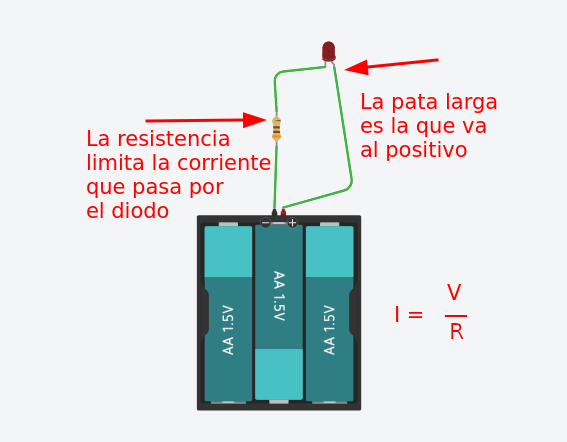

# Aprender y manejar las entradas y salidas con **Arduino**, usando **PlatformIO**
Si necesitas instalar **PlatformIO** en tu **VS Code**, puedes encontrar información en [este repositorio](https://github.com/drancope-clases/Instalar_Platformio).
<quote>En este repositorio encontrarás una explicación de cómo conectar un **pulsador** (*push button*) un un **LED** a tu arduino y cómo escribir las instrucciones en el lenguaje C++ para que funcionen.</quote>

## El **LED** y su resistencia para limitar la corriente.
Un **diodo emisor de luz** es un dispositivo que se comporta como un diodo normal, pero que emite luz al ser atravesado por la corriente. Para que esto ocurra hay que conectar su ánodo (pata larga) al voltaje positivo y el cátodo al negativo. El  efecto ocurrirá si el voltaje de la pila es superior al voltaje mínimo directo que necesita el LED para encenderse.

Y a partir de ese voltaje, la corriente empieza a fluir, creciendo mucho aunque el voltaje sea muy poco superior al mínimo. 

***El diodo se quema.***

**Es necesario limitar la corriente con una resistencia en serie**.

Ahora, si la resistencia es muy alta, la corriente será muy baja, y no vemos el diodo encendido. Si la resistencia es muy baja, pasa demasiada corriente, y se quema el diodo.

Si sabemos la corriente necesaria para encender el diodo, podremos ajustar el valor de la resistencia para que el encendido sea perfecto.

El voltaje que debe aguantar la resistencia es el voltaje de la pila menos el voltaje mínimo del diodo, que puede ser de aproximadamente 1 voltio, según el color del diodo. La corriente adecuada para un diodo está entre 10 y 20 miliamperios.

## El Botón y sus dos posibilidades de configuración.
