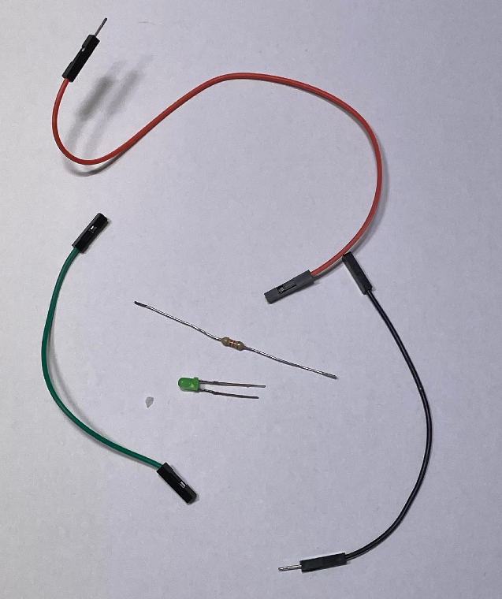
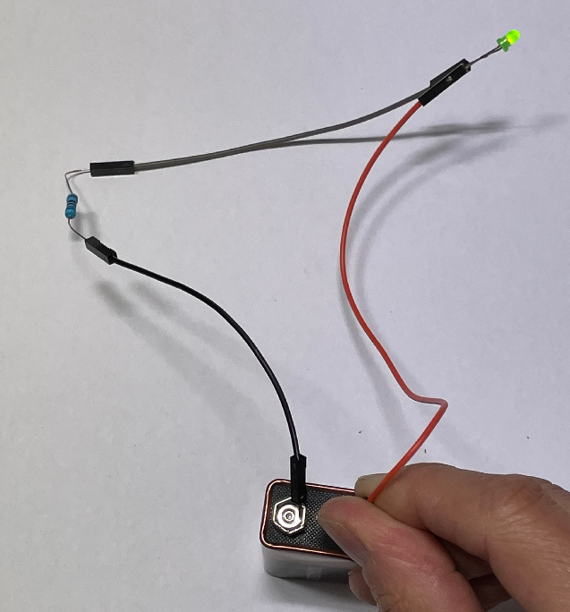
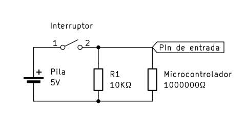
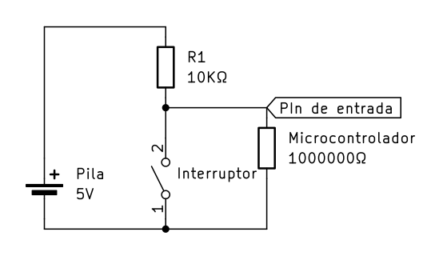
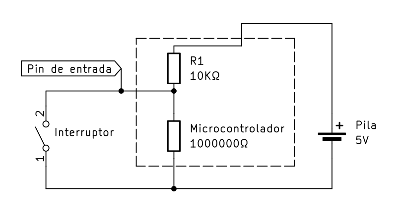

# Aprender y manejar las entradas y salidas con **Arduino**, usando **PlatformIO**
Si necesitas instalar **PlatformIO** en tu **VS Code**, puedes encontrar información en [este repositorio](https://github.com/drancope-clases/Instalar_Platformio).
<quote>En este repositorio encontrarás una explicación de cómo conectar un **pulsador** (*push button*) un un **LED** a tu arduino y cómo escribir las instrucciones en el lenguaje C++ para que funcionen.</quote>

## El **LED** y su resistencia para limitar la corriente.
Un **diodo emisor de luz** es un dispositivo que se comporta como un diodo normal, pero que emite luz al ser atravesado por la corriente. Para que esto ocurra hay que conectar su ánodo (pata larga) al voltaje positivo y el cátodo al negativo. El  efecto ocurrirá si el voltaje de la pila es superior al voltaje mínimo directo que necesita el LED para encenderse. Aproximadamente un voltio, pero depende del color del diodo.


Y a partir de ese voltaje, la corriente empieza a fluir, creciendo mucho aunque el voltaje sea muy poco superior al mínimo. ***El diodo se quema.***

**Es necesario limitar la corriente con una resistencia en serie**.



El circuito es sencillo: basta con unir *en serie* todos los componentes. La unión la haremos con los cables *Dupont*.

En cuanto al valor de la resistencia, si es muy alto, la corriente será muy baja, y no vemos el diodo encendido. Si la resistencia es muy baja, pasa demasiada corriente, y se quema el diodo.

Si sabemos la corriente necesaria para encender el diodo, podremos ajustar el valor de la resistencia para que el encendido sea perfecto.

El voltaje que debe aguantar la resistencia es el voltaje de la pila menos el voltaje mínimo del diodo, que puede ser de aproximadamente 1 voltio, según el color del diodo. La corriente adecuada para un diodo está entre 10 y 20 miliamperios.

Por lo tanto, cuando conectemos nuestro arduino, que tiene aproximadamente 5V, la resistencia será: R = 4V / 15mA = 266ØΩ. Con una resistencia de 220Ω se encenderá un poco más brillante. Con una resistencia de 330Ω, ahorraremos un poco de energía aunque se vea un poco menos el LED.

Con una pila de 9 voltios, podríamos poner una resistencia del doble de valor.

En la imagen vemos el circuito con una pila de 9 voltios y una resistencia de 510Ω.



### Usando una **protoboard**

La placa de prototipos, mirándola tal y como está en la imagen, tiene una o dos filas (llamadas buses) y muchas columnas (en amarillo en la imagen).


Las filas tienen todos sus agujeros conectados entre sí (en las placas grandes hay un corte hacia la mitad). Aquí es donde podemos aplicar los voltajes de alimentación del circuito. Si hay dos filas, una sería para positivo y otra para negativo.

Las columnas están divididas en dos partes de cinco agujeros interconectados entre sí. Cuando dos componentes tienen que conectarse entre sí, tendrán que insertar cada uno un pin en la misma columna.

## Conectando el LED al arduino.

El arduino UNO, el de la imagen, tiene dos filas de conectores para cables *Dupont*. En total, 32 puntos de conexión. Tiene también un conector de 6 pines macho, que no tendremos en cuenta, porque se usa para funciones especiales.

</img>

De los 32 puntos de conexión, 22 de ellos son entradas o salidas (se pueden configurar la mayoría) de datos. Las verdes, que son 14 son , solamente admiten encendido o apagado. Las 6 amarillas permiten la lectura de datos analógicos (o sea, valores reales de voltaje, comprendidos entre 0 y 5 voltios). Las dos grises de la zona superior derecha y las que comparten configuración con las verdes tienen asignadas, de manera preferente si necesitamos usarlas, tareas especiales de comunicación con determinados dispositivos.

Para conectar un LED (con su resistencia en serie) lo mejor es usar cualquiera de las verdes. Tenemos que decidir si conectamos el ánodo o el cátodo al *pin* verde, porque de una forma habrá que "encender" el pin para encender el diodo, y de la otra habrá que "apagar" el pin para lo mismo -esto se llama *lógica inversa*-.

Lo más cómodo para realizar el cableado de los componentes es usar una [**protoboard**](https://descubrearduino.com/protoboard/). Se trata de una pieza de plástico con agujeros para colocar los componentes, y que lleva conexiones internas entre filas o columnas de estos agujeros.

(Foto real)

## Instrucciones C++ para configurar y programar.
La programación del LED utiliza dos funciones propias de la biblioteca de funciones del Arduino: **pinMode()** y **digitalWrite()**. Los parámetros son el *número de pin* y el *modo de configuración* en la primera, y el *número de pin* y el *estado* de salida en la segunda (encendido o apagado). Todo son números. Pero es más fácil usar *recordatorios* para esos números, que suelen estar predefinidos en las cabeceras de compilación.

### Instrucción **digitalWrite()**. El lenguaje C++ y las *directivas de preprocesamiento*.
Normalmente, el número 0 significa "apagado", y el 1 es "encendido". Así, si hemos conectado el pin positivo del diodo al pin 3 del Arduino, y ya hemos configurado este pin con la función digitalWrite(), entonces, encender es <code>digitalWrite(3, 1);</code> y apagarlo es <code>digitalWrite(3, 0);</code>. Atención al punto y coma, que es **obligatorio** en cada instrucción.

Pero en los programas largos, a veces es difícil comprender el funcionamiento de nuestro código si está lleno de números por todas partes. Por eso, se sustituye el 1 y el 0 por palabras que nos muestran mejor el significado de lo que hacemos. Esto se suele hacer con una *instrucción* ***#define*** que no forma parte del lenguaje C++, sino que el compilador la lee y hace una sustitución de la palabra por el número antes de convertir el texto de nuestro programa en *programa real*.

Por ejemplo:
```C++
#define ENCENDIDO 1
#define APAGADO 0

digitalWrite(3, ENCENDIDO);
delay(1000);
digitalWrite(3, APAGADO);
```

Esto viene ya incluído en archivos especiales que se llaman ***cabeceras*** de compilación, en las bibliotecas de funciones de Arduino. Solamente tenemos que *incluir* estas cabeceras en nuestro programa, al principio:

```C++
#include <Arduino.h>
```

Dentro de este archivo podríamos ver escritas las siguientes líneas:
```C++
#define HIGH 1
#define LOW 0
```
También existen líneas de definición para el modo de configuración de los pines, *entrada*, *salida* o *resistencia de acoplamento a positivo* (**INPUT**, **OUTPUT**, **INPUT_PULLUP**. Más adelante las veremos), de modo que no tendremos que aprendernos el número para cada modo. Así, nuestro programa deberá adoptar esta forma más correcta:

```C++
#include <Arduino.h>

void setup(){
    pinMode(3, OUTPUT);
    digitalWrite(3, HIGH);
    delay(1000);
    digitalWrite(3, LOW);
}
```
### Funciones.
Un programa de Arduino tiene al menos 2 funciones: ```setup()``` y ```loop()```.

Una función es un fragmento de código que se agrupa para realizar una tarea que es más o menos cerrada y está completa en sí misma, pero que puede ser reutilizada durante el funcionamiento del programa principal.

En realidad, un programa podría tener solamente una función principal, pero esto obligaría a repetir muchos trozos de código. Por esto se separan estos trozos que se repiten, y se convierten en función.

## El Botón y sus dos posibilidades de configuración.

Queremos que nuestro pulsador sirva al microcontrolador para decidir cuándo encender o apagar el diodo. Así que no vamos a insertarlo en el circuito del LED.

El arduino tiene 13 pines de entrada o salida configurables. La entrada se puede configurar de dos maneras, pero para entenderlas tenemos que examinar los siguientes circuitos:

<table><tr><td width=40%></img></td><td>
Este esquema es un circuito básico: una batería, un interruptor y una resistencia. Usando la Ley de Ohm, vemos que la corriente es muy pequeña, porque la resistencia es muy alta. I = V / R, con lo que I = 0,000001 Amperios.</td></tr></table>

Esta resistencia sería la entrada del microcontrolador. Necesita una corriente muy pequeña, demasiado pequeña. En el uso cotidiano, aunque tengamos el interruptor abierto, <b>la simple electricidad estática puede hacer que pase esa corriente, y subiría el voltaje en el punto superior de la resistencia</b>. El voltaje se detectaría como encendido, de manera "accidental".

Para resolver este problema hay que usar una de estas dos posibilidades:

<table><tr><td width=50%></img></td><td></img></td></tr></table>

En la de la izquierda, colocamos una resistencia de un valor alto, pero no tanto como el microprocesador. Cuando el interruptor está abierto, la corriente que pueda generar la electricidad estática circulará por esta resistencia, ya que tiene un valor adecuado. Y así, el voltaje en el pin de entrada no subirá casi nada, detectándose como cero. Cuando encendemos el interruptor, los voltios de la pila hacen circular una corriente de 0,0005 A, y el pin de entrada detecta "encendido".

En el de la derecha, colocamos el interruptor entre negativo y el pin de entrada, y la resistencia externa entre el positivo de la pila y el pin de entrada. Cuando el interruptor está abierto, la corriente circula a través de las dos resistencias. El voltaje se reparte entre ellas, pero como la externa es mucho más baja, el microcontrolador se queda con casi todo: le corresponden 4,95 Voltios, y se detecta como encendido. Cuando cerramos el interruptor, el pin de entrada queda conectado a negativo, y se detecta como "apagado". En este montaje, el interruptor funciona al revés: encenderlo significa que la entrada es ```0```, y apagarlo, que la entrada será ```1```. Esta disposición es muy utilizada. Tanto, que esa resistencia está incluída ya dentro del microprocesador (y según el microcontrolador, a veces también la otra), aunque está aislada mediante un interruptor externo que podemos activar en la configuración.

{width=80%}

### Instrucciones de configuración

Para conectar el botón añadiendo nosotros la resistencia externa, debemos usar:

```pinMode(PIN, INPUT);```

Para utilizar la resistencia interna del Arduino, usaremos:

```pinMode(PIN, INPUT_PULLUP);```

Ambas se deben incluir dentro de la función ```setup()```.

### La rutina de detección.

Existen varias posibilidades para detectar cuándo se pulsa el botón. En líneas generales deberíamos hacer lo más independiente posible la deteción del pulsador del resto del programa. En el mundo real se suelen usar *interrupciones*, pero en nuestro ejemplo, que no es muy complicado, vamos a emplear un bloque corto de instrucciones al principio del bucle principal del programa. De manera normal sería:

```c++
void loop() {
    while (digitalRead(PIN) == PULSADO) {
        // hacer lo que tenga que hacer el botón
        // evitar rebotes de pulsación
    }
    // resto del programa
}
```

Debemos prestar atención a dos cosas: Primero, que dentro del bloque ```while```, lo que tenga que hacer el botón es alguna secuencia de instrucciones, preferiblemente concisa (clara y corta), pero también hay que añadir un pequeño retraso (```delay()```), para evitar un problema eléctrico de secuencias de conexión y desconexión que ocurre siempre en los primeros milisegundos, y que si no evitamos, hará el efecto de que hemos pulsado el botón un montón de veces. Segundo, que el resto del programa debe ser también lo más corto -rápido- posible, sin retrasos, para que no quede sin detectar una pulsación del botón mientras el controlador está haciendo otra cosa.

la palabra ```PULSADO``` debemos definirla antes, y será **1** si usamos lógica positiva, o **0** si el botón está conectado a negativo.

Lo habitual es utilizar algún tipo de señal (una variable, que pueda mantener su valor en sucesivas repeticiones del bucle) para que el resto del programa sepa que hemos pulsado el botón si es necesario. Así, nos quedaría:

```c++
#define PULSADO 0
int estado = 0;

void loop() {
    while (digitalRead(PIN) == PULSADO) {
        digitalWrite(LED, estado);
        estado != estado;
        delay(20);
    }
    // resto del programa
}
```

En esta versión, la salida se enciende o apaga cada vez que pulsemos el botón. ```PIN``` y ```LED``` deben ser los números de los pines del Arduino en los que hemos conectado el botón y el diodo.
